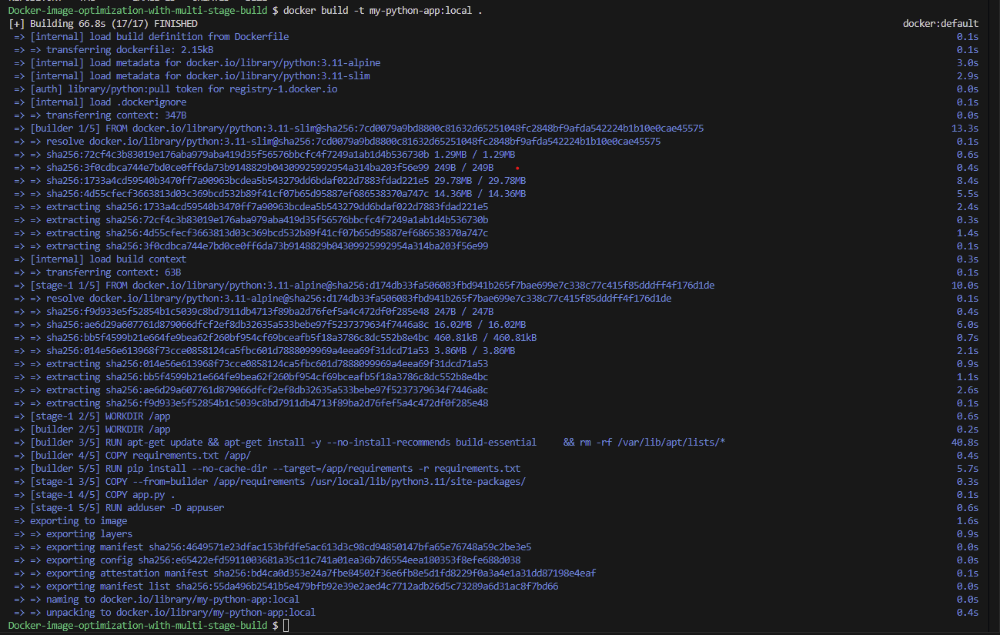
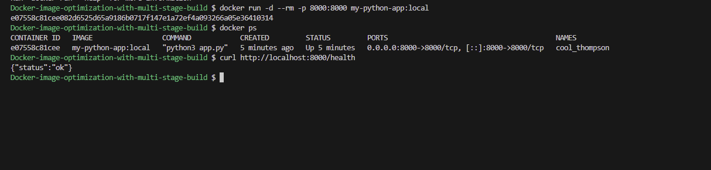
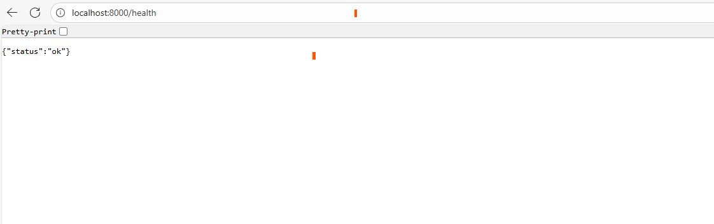

# Docker-image-optimization

## Project Overview

This project demonstrates how to build a highly optimized multi-stage Docker image that aligns with industry best practices. It uses a lightweight base image and separates the build process into two stages: a builder stage for compiling and installing dependencies, and a runtime stage that contains only the minimal files required to run the application.
The result is a cleaner, smaller, more secure, and production-ready Docker image that is easier to maintain and deploy.

## Project Structure

```
your-app/
 ├── app.py
 ├── requirements.txt
 ├── Dockerfile
 └── .dockerignore   

```

## app.py (Flask app with health endpoint)

```
from flask import Flask, jsonify

app = Flask(__name__)

@app.route('/')
def index():
    return jsonify({"message": "Hello from your Dockerized Flask app!"})

@app.route('/health')
def health():
    return jsonify({"status": "ok"}), 200

if __name__ == "__main__":
    app.run(host="0.0.0.0", port=8000)

```

### This app:

* Serves a root endpoint (/)
* Has a health check endpoint (/health)
* Runs on port 8000
* Binds to 0.0.0.0 so Docker can expose it


## requirements.txt

```
Flask==3.0.2

```

## Dockerfile

```
#############################################
# Stage 1: Builder
# This stage installs dependencies in isolation.
# The goal is to keep the final image small by
# excluding build tools and caches.
#############################################
FROM python:3.11-slim AS builder

# Set the working directory inside the container
WORKDIR /app

# Install OS packages needed to compile Python dependencies
# --no-install-recommends prevents installation of unnecessary extras
RUN apt-get update && apt-get install -y --no-install-recommends build-essential \
    && rm -rf /var/lib/apt/lists/*

# Copy only the requirements file first
# This allows Docker to cache the dependency installation layer
COPY requirements.txt /app/

# Install Python dependencies into a dedicated folder
# --no-cache-dir prevents pip from storing cache files
# --target installs packages to a directory we can copy later
RUN pip install --no-cache-dir --target=/app/requirements -r requirements.txt 


#############################################
# Stage 2: Final Runtime Image
# Much smaller — contains only Python runtime +
# your application code and installed dependencies.
# Switch final image to distroless size (python:3.11-alpine)
#############################################
FROM python:3.11-alpine

# Set working directory for the runtime container
WORKDIR /app

# Copy the installed dependencies from the builder stage
# into Python's site-packages directory in the final image
COPY --from=builder /app/requirements /usr/local/lib/python3.11/site-packages/

# Copy only the actual application source code into the container
# Avoid using "COPY . /app". build-essential is installed in Stage 1, This would copy the builder layer into the final image indirectly.
COPY app.py .

# Create a non-root user for security (best practice)
RUN adduser -D appuser


# Switch to the non-root user to run the app
USER appuser

# Document that the application will listen on port 8000
EXPOSE 8000

# Command that will run when the container starts
CMD ["python3", "app.py"]

```

## .dockerignore file

```
__pycache__/
*.pyc
*.pyo
*.pyd

venv/
env/

.git
.gitignore

.DS_Store
.idea/
.vscode/

*.log
.env

```

## Build & Run the App

* Build

```
docker build -t my-python-app .

```

* Run

```
docker run -p 8000:8000 my-python-app

```

* Test

    * Open in your browser:
        * Open in your browser:
        ```
        http://localhost:8000/

        ``` 
        http://localhost:8000/health

        ```

* Or using curl:
```
curl http://localhost:8000/health

```
* Response:

```
{"status": "ok"}

```

## SCREEN SHOTS





